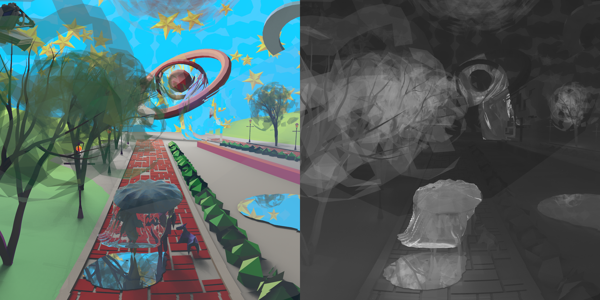

# ANTLER
A textureless rendering engine written in Rust.

[](https://crates.io/crates/antler)
<!-- [](https://docs.rs/antler) -->
[](https://freddywordingham.github.io/antler/)

[](https://travis-ci.org/FreddyWordingham/arctk)

# Usage

1) If you don't already have it install Rust: https://www.rust-lang.org/
2) Install Antler using: cargo install antler (or without gui: cargo install antler --no-default-features)
3) Navigate to parent of input directory (example: git clone https://github.com/FreddyWordingham/worlds; cd worlds)
4) Run: antler-window parameters.json5 (or without live window: antler parameters.json)
5) Tinker!

# Documentation
Binary specific https://freddywordingham.github.io/antler/
Supporting library https://freddywordingham.github.io/arctk/

# Pamaters
Example parameters.json5:
```json5
{
    tree: { Here: {                                 // Adaptive-tree settings specified here:
        tar_tris: 5,                                // Target num triangles per leaf cell.
        max_depth: 8,                               // (ignore) Maximum tree splitting depth.
        padding: 0.01,                              // (ignore) Fraction to increase leaf cells.
    }},
    sett    : { There: 'sett/standard.json5' },     // Use the sim settings from this file.
    shader  : { There: 'shaders/nice.json5' },      // Use the shader from this file.
    surfs   : { There: 'scenes/path.json5' },       // Thus surfaces in this file.
    attrs   : { There: 'attrs/path.json5' },        // Use the attributes from this file.
    cols    : { There: 'cols/path.json5' },         // Use the colours from this file.
    cam     : { Here: {                             // Camera settings specified here:
        pos     : [-52, 0, 7],                      // Camera observation position.
        tar     : [-4.5, 0, 1.2],                   // Camera target postion.
        lens    : { Perspective: {fov: 60.0} },     // Lens type and parameters.
        aspect  : "Square",                         // Aspect ratio type.
        // ss_power: 3,                             // Optional super sampling. NxN per pixel.
        hr_res  : 400,                              // Number of horizontal pixels.
    }},
    update_size: 400,                               // Pixels per window refresh.
}
```

# Examples

Render both <- space and time -> (+ other metrics distance/surface normals/etc.)


[More renderings here!](https://www.instagram.com/____f.r.e.d.d.y____/)
