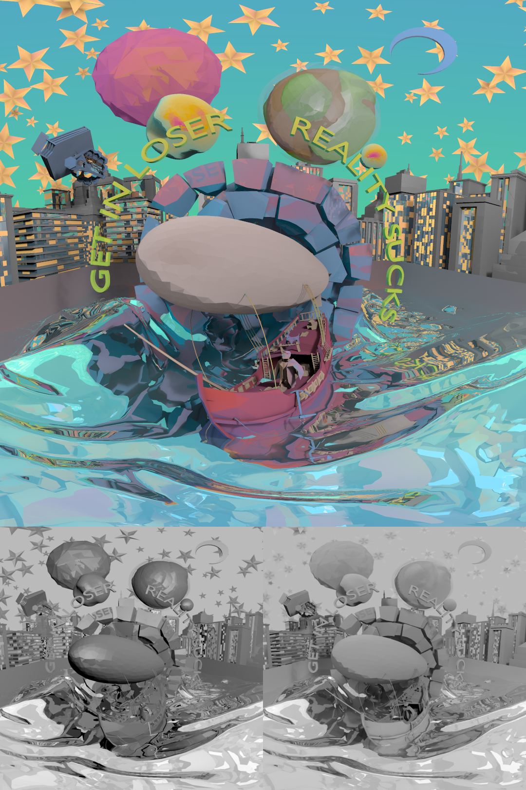
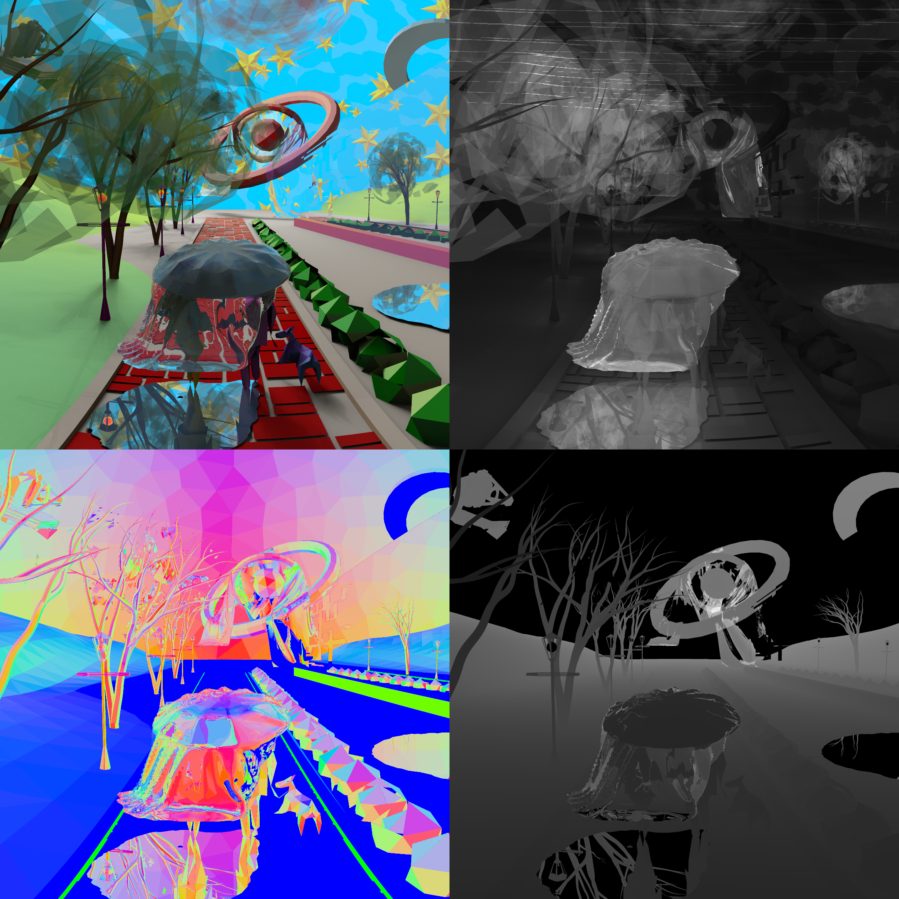

# ANTLER
A textureless rendering engine written in Rust.

<!--  -->

# Usage

1) If you don't already have it install Rust: https://www.rust-lang.org/
2) Install Antler using: `cargo install antler`
3) Navigate to input directory
4) Run: `antler parameters.json5`
5) Images written into ./output directory.
6) Add attributes in src/parts/attributes.rs
7) Add new output in src/pipe/output.rs
8) Tinker with the src/engines/antler.rs file to add new effects!

# Documentation
Binary specific https://freddywordingham.github.io/antler/

Supporting library https://freddywordingham.github.io/arctk/

# Examples

View the <- light and shadow -> calculations.

Render both <- space and time -> (+ other metrics distance/surface normals/etc.)

[More renderings here!](https://www.instagram.com/____f.r.e.d.d.y____/)
